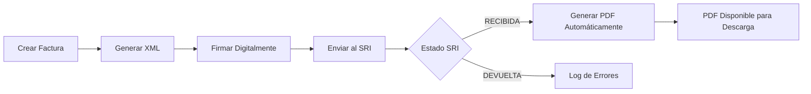

# 🧾 Sistema de Facturación Electrónica

[](https://choosealicense.com/licenses/mit/)
[](https://nodejs.org/)
[](https://www.typescriptlang.org/)
[](https://www.mongodb.com/)
[](https://expressjs.com/)
[](https://www.sri.gob.ec/)


**Sistema de Facturación Electrónica** (F Sri) es una API multi-tenant SaaS para Ecuador, con integración completa al SRI (Servicio de Rentas Internas) y un backoffice de administración. Este repositorio es un fork privado y divergente de [XaviMontero/f-sri](https://github.com/XaviMontero/f-sri) (MIT) — ver la sección de Agradecimientos, al final de este documento, para la atribución completa.

## 🚀 Características Principales

- ✅ **Facturación Electrónica Completa** - Facturas, notas de crédito/débito, guías de remisión y retenciones (ATS 2.0.0): generación, firma y envío al SRI
- 🏢 **Multi-tenant** - Cada empresa emisora (tenant) tiene sus propios datos, certificado y claves de API; aislados entre sí
- 🔐 **API Keys por Tenant** - Acceso a la API de facturación (`/api/v1/*`) mediante claves provisionadas desde el backoffice de administración
- 🛠️ **Backoffice de Administración** - SPA en React (`/admin`) para gestionar tenants, invitaciones y API keys, protegida con JWT de administrador
- ✉️ **Onboarding por Invitación** - Un admin genera una invitación de un solo uso; el cliente la redime en una página pública (`/onboarding`) subiendo su `.p12` y recibe su primera API key
- 📱 **API RESTful Completa** - Documentación con Swagger/OpenAPI en `/docs`
- 📄 **PDFs Automáticos** - Generación y almacenamiento en S3 (por defecto) / Local / Cloudinary
- 🔒 **Firma Digital** - Certificado `.p12` cifrado en reposo (nunca expuesto en las respuestas de la API)
- 📧 **Notificaciones Email** - Envío automático de facturas vía Resend, con el PDF (RIDE) adjunto
- 🧪 **Testing Completo** - Suite de tests automatizados (Jest)

## ✨ Flujo de Facturación Automático



### 🔄 Proceso Detallado

1. **📝 Creación**: Se envía la factura via `/api/v1/invoice/complete`
2. **📄 XML**: Se genera el XML según normativa del SRI
3. **🔐 Firma**: Se firma digitalmente con el certificado almacenado (base64)
4. **📤 Envío**: Se envía al SRI (ambiente pruebas o producción)
5. **📨 Recepción**: Si el SRI responde `"RECIBIDA"`, el comprobante queda aceptado _para procesamiento_ — todavía no autorizado, y aún puede ser rechazado. Se encola una consulta de autorización.
   - **📊 Log**: `✅ FACTURA RECIBIDA POR SRI - ID: [id], Clave: [clave], Secuencial: [seq]`
6. **✅ Autorización**: Cuando el SRI responde `"AUTORIZADO"`, y solo entonces, se ejecuta automáticamente:
   - **📄 Generación del RIDE** con el número y la **fecha de autorización reales** del SRI
   - **☁️ Almacenamiento** en el proveedor configurado (S3 recomendado en producción; Local/Cloudinary como alternativas)
   - **📧 Email** al cliente con el PDF adjunto, vía Resend (si `RESEND_API_KEY` y `EMAIL_FROM` están configurados)
7. **📥 Disponibilidad**: PDF disponible via API, servido mediante una URL de descarga (presignada en S3)

> El RIDE se genera en la autorización y no en la recepción a propósito: antes de estar autorizado no existe una fecha de autorización que imprimir, y un comprobante recibido todavía puede ser rechazado. Los pasos 6 y 7 los ejecuta el proceso `worker` a través de la cola (BullMQ + Redis), no la petición HTTP.

## 🛠️ Tecnologías

- **Backend**: Node.js + TypeScript + Express
- **Base de Datos**: MongoDB + Mongoose
- **Autenticación**: API key por tenant (`/api/v1/*`) + JWT de administrador (`/admin/api/*`), bcrypt para contraseñas
- **Backoffice**: React + Vite (`admin/`)
- **Documentación**: Swagger/OpenAPI 3.0
- **Testing**: Jest + Supertest
- **Firma Digital**: node-forge
- **PDF**: Puppeteer
- **Almacenamiento**: Amazon S3 (por defecto recomendado) / Local / Cloudinary
- **Email**: Resend

## 📦 Instalación Rápida

```bash
# Clonar este repositorio (privado — pide acceso a tu equipo)
git clone <url-de-este-repositorio>
cd f-sri

# Instalar dependencias
npm install

# Configurar variables de entorno
cp .env.example .env
# Editar .env con tus configuraciones (ver .env.example para el detalle de cada variable)

# Crear el primer usuario administrador (necesario antes de poder usar el backoffice)
npm run create-admin -- admin@tuempresa.com "una-contraseña-segura"

# Ejecutar en desarrollo
npm run dev

# Construir para producción
npm run build
npm start
```

## ⚙️ Configuración

### Variables de Entorno Esenciales

`src/config/env.config.ts` valida al arrancar (fail-fast) que `JWT_SECRET`,
`ENCRYPTION_KEY`, `MONGO_URI` y `PUBLIC_URL` estén presentes y tengan el
formato correcto. Ver `.env.example` para la lista completa (CORS, SRI,
almacenamiento de PDFs, email) con explicaciones en español.

```env
# Base de datos
MONGO_URI=mongodb://localhost:27017/f-sri

# Seguridad
JWT_SECRET=tu_clave_jwt_super_secreta_aqui
# 64 caracteres hexadecimales (32 bytes): openssl rand -hex 32
ENCRYPTION_KEY=1234567890abcdef1234567890abcdef1234567890abcdef1234567890abcd

# URL pública de este servidor, usada para construir los enlaces de onboarding
PUBLIC_URL=http://localhost:3000

# Servidor
PORT=3000
NODE_ENV=development

# SRI Ecuador - URLs de servicios web
SRI_ENVIRONMENT=1  # 1=Pruebas, 2=Producción
SRI_RECEPCION_URL_PRUEBAS=https://celcer.sri.gob.ec/comprobantes-electronicos-ws/RecepcionComprobantesOffline?wsdl
SRI_RECEPCION_URL_PRODUCCION=https://cel.sri.gob.ec/comprobantes-electronicos-ws/RecepcionComprobantesOffline?wsdl

# Almacenamiento de PDFs (s3 recomendado en producción; local para desarrollo sin credenciales de nube)
PDF_STORAGE_PROVIDER=s3

# Amazon S3 (solo si PDF_STORAGE_PROVIDER=s3; bucket privado, descargas vía URL presignada)
AWS_ACCESS_KEY_ID=tu_access_key_id
AWS_SECRET_ACCESS_KEY=tu_secret_access_key
AWS_REGION=us-east-1
S3_BUCKET=tu-bucket-de-pdfs
```

## 🔒 Autenticación

El sistema usa dos esquemas de autenticación independientes, sin ningún tipo de
auto-registro público (el antiguo `POST /register` fue retirado por completo):

- **API de facturación** (`/api/v1/*`): API key por tenant. Envía la clave en el
  header `X-API-Key` (o `Authorization: Bearer sk_live_...`). Las claves se
  provisionan desde el backoffice de administración o se obtienen al completar
  el onboarding (ver más abajo).
- **API de administración** (`/admin/api/*`): login con JWT para el personal
  interno (rol `admin`, token de 4 días de validez). Bootstrapea el primer
  usuario admin con `npm run create-admin` (ver `scripts/create-admin.ts`),
  luego autentica con:

```bash
POST /admin/api/auth/login
{
  "email": "admin@miempresa.com",
  "password": "password123"
}
```

### Alta de un nuevo tenant (onboarding por invitación)

No existe auto-registro: un administrador da de alta cada tenant y le entrega
un enlace de invitación de un solo uso; el propio cliente completa su alta
subiendo su certificado `.p12`:

1. Admin: `POST /admin/api/tenants` → crea la empresa emisora
2. Admin: `POST /admin/api/tenants/{id}/invites` → genera una invitación (expira en 7 días), devuelve `onboarding_url`
3. Cliente: abre `onboarding_url` (SPA pública en `/onboarding`) o llama directamente a
   `POST /onboarding/api/complete` con `{ token, certificate, certificate_password }`
4. La respuesta incluye la **primera API key** del tenant (`api_key`), mostrada una única vez

Ver [CURL_EXAMPLES.md](CURL_EXAMPLES.md) para el flujo completo con ejemplos reales.

## 📚 Documentación API

Una vez ejecutando el servidor, accede a:

- **Swagger UI**: `http://localhost:3000/docs`
- **API JSON (OpenAPI)**: `http://localhost:3000/swagger.json`

El Swagger documenta la API de facturación para sistemas cliente (`/api/v1/*`,
autenticada con API key). El backoffice de administración y el onboarding
existen y están en producción, pero no están modelados en el Swagger — ver
este README, [SECURITY.md](SECURITY.md) y [CURL_EXAMPLES.md](CURL_EXAMPLES.md).

### Endpoints Principales

```bash
# Administración (backoffice, JWT admin)
POST /admin/api/auth/login                # Login de administrador
GET  /admin/api/tenants                   # Listar tenants
POST /admin/api/tenants                   # Crear tenant
PUT  /admin/api/tenants/{id}/active       # Activar/desactivar un tenant (corta el acceso de todas sus API keys)
POST /admin/api/tenants/{id}/invites      # Generar invitación de onboarding
POST /admin/api/tenants/{id}/api-keys     # Emitir una API key para un tenant
GET  /admin/api/tenants/{id}/usage        # Conteo de uso (metering) de un tenant
GET  /admin/api/usage/summary             # Resumen de uso de todos los tenants

# Onboarding (público, sin autenticación previa)
GET  /onboarding/api/invite/{token}     # Previsualizar una invitación
POST /onboarding/api/complete           # Completar alta y obtener la primera API key

# Facturación (X-API-Key)
POST /api/v1/invoice/complete    # Crear y procesar factura
GET  /api/v1/invoice            # Listar facturas

# PDFs (Generación Automática, X-API-Key)
GET  /api/v1/invoice-pdf                            # Listar todos los PDFs
GET  /api/v1/invoice-pdf/invoice/{facturaId}        # PDF por ID de factura
GET  /api/v1/invoice-pdf/access-key/{claveAcceso}   # PDF por clave de acceso
GET  /api/v1/invoice-pdf/download/{claveAcceso}     # Descargar PDF (redirect a URL presignada)
POST /api/v1/invoice-pdf/regenerate/{facturaId}     # Regenerar PDF

# Gestión (X-API-Key, siempre acotada al tenant autenticado)
GET  /api/v1/issuing-company    # La propia empresa emisora del tenant
GET  /api/v1/client            # Clientes del tenant
GET  /api/v1/product           # Productos del tenant
```

### 📄 Gestión de PDFs

Los PDFs se generan **automáticamente** cuando el SRI confirma la recepción (`estado: "RECIBIDA"`) y se almacenan en el proveedor configurado (S3 recomendado en producción). No requiere intervención manual.

```bash
# Verificar si una factura tiene PDF generado
curl -H "X-API-Key: $API_KEY" \
  http://localhost:3000/api/v1/invoice-pdf/invoice/64f8a1b2c3d4e5f6a7b8c9d2

# Descargar PDF de factura (redirige a la URL de descarga del proveedor configurado)
curl -L -H "X-API-Key: $API_KEY" \
  http://localhost:3000/api/v1/invoice-pdf/download/1705202501012345678900110010010000000011234567890 \
  -o factura.pdf
```

## 🧪 Testing

```bash
# Ejecutar todos los tests
npm test

# Tests en modo watch
npm run test:watch

# Coverage
npm run test:coverage
```

## 🚀 Despliegue

### Docker + VPS (Hostinger) + MongoDB Atlas

El repo incluye un `Dockerfile` multi-stage real (API + SPA de administración,
con las dependencias de Chromium que necesita Puppeteer) y un
`compose.prod.yml` (API + Caddy como reverse proxy con TLS automático, sin
contenedor de Mongo — la base de datos vive en MongoDB Atlas). Ver
[`DEPLOYMENT.md`](DEPLOYMENT.md) para el procedimiento completo (variables de
entorno requeridas, allowlisting de la IP del VPS en Atlas, cómo crear el
primer admin dentro del contenedor, y el flujo de actualización).

> ⚠️ **Build local en Mac Apple Silicon (arm64):** usa
> `docker build --platform linux/amd64 .` — Chromium no tiene build oficial
> para Linux ARM64, así que un build nativo arm64 arranca pero Puppeteer no
> puede lanzar el navegador en tiempo de ejecución. Un VPS real (Hostinger)
> es x86_64, así que esto solo afecta builds locales en Apple Silicon. Ver
> `DEPLOYMENT.md` y el encabezado del `Dockerfile` para más detalle.

## 🤝 Contribuir

Este es un repositorio **privado**: no hay un flujo de fork público ni Pull
Requests externos. El proceso es interno al equipo:

1. Crea una rama para tu feature/fix (`git checkout -b feature/nombre-descriptivo`)
2. Commit tus cambios siguiendo los estándares de código (ver [CONTRIBUTING.md](CONTRIBUTING.md) para convenciones de commits y estilo)
3. Push a la rama y abre un Pull Request dentro de este repositorio
4. Verifica que `npm run validate` pase antes de pedir revisión

## 📋 Roadmap

Ya implementado: facturas, notas de crédito/débito, guías de remisión y
retenciones (ATS 2.0.0); multi-tenancy con aislamiento de datos; backoffice de
administración con onboarding por invitación; almacenamiento de PDFs en S3;
email transaccional vía Resend; despliegue en Docker/VPS.

- [ ] Dashboard de analítica de uso por tenant (más allá del backoffice actual)
- [ ] App móvil
- [ ] Soporte para Azure Blob Storage como proveedor de PDFs

## 📄 Licencia

Este proyecto está bajo la Licencia MIT. Ver [LICENSE](LICENSE) para más detalles.

## 🙏 Agradecimientos

Este repositorio es un **fork privado y divergente** del proyecto original
[XaviMontero/f-sri](https://github.com/XaviMontero/f-sri), publicado bajo
licencia MIT. La base de facturación electrónica (generación de XML, firma
digital, integración con los servicios web del SRI) proviene de ese proyecto;
las fases de productización SaaS (multi-tenancy, API keys, backoffice de
administración, onboarding por invitación, almacenamiento en S3, envío de
email vía Resend, despliegue en Docker) se construyeron sobre esa base en
este fork.

- [XaviMontero/f-sri](https://github.com/XaviMontero/f-sri) — proyecto original del que este repositorio deriva
- [SRI Ecuador](https://www.sri.gob.ec/) por la documentación técnica

---

Hecho con ❤️ para la comunidad ecuatoriana de desarrolladores.
