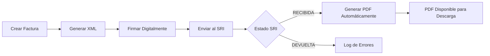

# 🧾 Sistema de Facturación Electrónica

[](https://github.com/XaviMontero/f-sri/actions/workflows/ci.yml)
[](https://github.com/XaviMontero/f-sri/actions)
[](https://github.com/XaviMontero/f-sri)
[](https://choosealicense.com/licenses/mit/)
[](https://nodejs.org/)
[](https://www.typescriptlang.org/)
[](https://www.mongodb.com/)
[](https://expressjs.com/)
[](https://github.com/XaviMontero/f-sri/releases)
[](CONTRIBUTING.md)
[](https://www.sri.gob.ec/)


**Sistema de Facturación Electrónica** es un sistema libre y de código abierto diseñado específicamente para Ecuador, con integración completa al SRI (Servicio de Rentas Internas).

## 🚀 Características Principales

- ✅ **Facturación Electrónica Completa** - Generación, firma y envío al SRI
- 🔐 **API Keys por Tenant** - Acceso a la API de facturación mediante claves provisionadas por un administrador
- 📱 **API RESTful Completa** - Documentación con Swagger/OpenAPI
- 🏢 **Multi-empresa** - Gestión de múltiples empresas emisoras
- 📄 **PDFs Automáticos** - Generación y almacenamiento en la nube (Cloudinary/Local)
- 🔒 **Firma Digital** - Certificado digital en base64 (sin archivos locales)
- 📧 **Notificaciones Email** - Envío automático de facturas
- 🧪 **Testing Completo** - Suite de tests automatizados

## ✨ Flujo de Facturación Automático



### 🔄 Proceso Detallado

1. **📝 Creación**: Se envía la factura via `/api/v1/invoice/complete`
2. **📄 XML**: Se genera el XML según normativa del SRI
3. **🔐 Firma**: Se firma digitalmente con el certificado almacenado (base64)
4. **📤 Envío**: Se envía al SRI (ambiente pruebas o producción)
5. **✅ Confirmación**: Si SRI responde `"RECIBIDA"`, se ejecuta automáticamente:
   - **📄 Generación de PDF** con formato oficial
   - **☁️ Almacenamiento** en el proveedor configurado (Cloudinary por defecto)
   - **📊 Log de éxito**: `✅ FACTURA RECIBIDA POR SRI - ID: [id], Clave: [clave], Secuencial: [seq]`
6. **📥 Disponibilidad**: PDF disponible via API con URL pública del proveedor

## 🛠️ Tecnologías

- **Backend**: Node.js + TypeScript + Express
- **Base de Datos**: MongoDB + Mongoose
- **Autenticación**: JWT + bcrypt
- **Documentación**: Swagger/OpenAPI 3.0
- **Testing**: Jest + Supertest
- **Firma Digital**: node-forge
- **PDF**: Puppeteer
- **Almacenamiento**: Cloudinary (por defecto) / Local

## 📦 Instalación Rápida

```bash
# Clonar el repositorio
git clone https://github.com/XaviMontero/f-sri.git
cd sistema-facturacion-electronica

# Instalar dependencias
npm install

# Configurar variables de entorno
cp .env.example .env
# Editar .env con tus configuraciones
# Nota: Necesitarás una cuenta de Cloudinary (gratuita) para almacenar PDFs

# Ejecutar en desarrollo
npm run dev

# Construir para producción
npm run build
npm start
```

## ⚙️ Configuración

### Variables de Entorno Esenciales

```env
# Base de datos
MONGODB_URI=mongodb://localhost:27017/f-sri

# Seguridad
JWT_SECRET=tu_clave_jwt_super_secreta_aqui
ENCRYPTION_KEY=clave_encriptacion_32_caracteres!!

# Servidor
PORT=3000
NODE_ENV=development

# SRI Ecuador - URLs de servicios web
SRI_ENVIRONMENT=1  # 1=Pruebas, 2=Producción
SRI_RECEPCION_URL_PRUEBAS=https://celcer.sri.gob.ec/comprobantes-electronicos-ws/RecepcionComprobantesOffline?wsdl
SRI_RECEPCION_URL_PRODUCCION=https://cel.sri.gob.ec/comprobantes-electronicos-ws/RecepcionComprobantesOffline?wsdl

# Almacenamiento de PDFs (cloudinary o local)
PDF_STORAGE_PROVIDER=cloudinary  # Por defecto: cloudinary

# Cloudinary (para almacenar PDFs en la nube)
CLOUDINARY_CLOUD_NAME=tu_cloud_name
CLOUDINARY_API_KEY=tu_api_key
CLOUDINARY_API_SECRET=tu_api_secret
```

## 🔒 Autenticación

El sistema usa dos esquemas de autenticación independientes:

- **API de facturación** (`/api/v1/*`): API key por tenant. Envía la clave en el
  header `X-API-Key` (o `Authorization: Bearer sk_live_...`). Las claves se
  provisionan desde el backoffice de administración (no hay auto-registro).
- **API de administración** (`/admin/api/*`): login con JWT para el personal
  interno. Bootstrapea el primer usuario admin con `npm run create-admin`
  (ver `scripts/create-admin.ts`), luego autentica con:

```bash
POST /admin/api/auth/login
{
  "email": "admin@miempresa.com",
  "password": "password123"
}
```

## 📚 Documentación API

Una vez ejecutando el servidor, accede a:

- **Swagger UI**: `http://localhost:3000/api-docs`
- **API JSON**: `http://localhost:3000/api-docs.json`

### Endpoints Principales

```bash
# Autenticación
POST /admin/api/auth/login   # Login de administrador (backoffice)

# Facturación
POST /api/v1/invoice/complete    # Crear y procesar factura
GET  /api/v1/invoice            # Listar facturas

# PDFs (Generación Automática)
GET  /api/v1/invoice-pdf                    # Listar todos los PDFs
GET  /api/v1/invoice-pdf/factura/{id}       # PDF por ID de factura
GET  /api/v1/invoice-pdf/{id}/download      # Descargar PDF
GET  /api/v1/invoice-pdf/clave/{claveAcceso} # PDF por clave de acceso
POST /api/v1/invoice-pdf/regenerate/{id}    # Regenerar PDF

# Gestión
GET  /api/v1/issuing-company    # Empresas emisoras
GET  /api/v1/client            # Clientes
GET  /api/v1/product           # Productos
```

### 📄 Gestión de PDFs

Los PDFs se generan **automáticamente** cuando el SRI confirma la recepción (`estado: "RECIBIDA"`) y se almacenan en el proveedor configurado (Cloudinary por defecto). No requiere intervención manual.

```bash
# Verificar si una factura tiene PDF generado
curl -H "Authorization: Bearer $TOKEN" \
  http://localhost:3000/api/v1/invoice-pdf/factura/64f8a1b2c3d4e5f6a7b8c9d2

# Descargar PDF de factura
curl -H "Authorization: Bearer $TOKEN" \
  http://localhost:3000/api/v1/invoice-pdf/64f8a1b2c3d4e5f6a7b8c9d8/download \
  -o factura.pdf
```

## 🧪 Testing

```bash
# Ejecutar todos los tests
npm test

# Tests en modo watch
npm run test:watch

# Coverage
npm run test:coverage
```

## 🚀 Despliegue

### Heroku

```bash
# Crear app
heroku create tu-sistema-facturacion

# Configurar variables
heroku config:set MONGODB_URI=tu_mongodb_uri
heroku config:set JWT_SECRET=tu_jwt_secret

# Desplegar
git push heroku main
```

### Docker + VPS (Hostinger) + MongoDB Atlas

El repo incluye un `Dockerfile` multi-stage real (API + SPA de administración,
con las dependencias de Chromium que necesita Puppeteer) y un
`compose.prod.yml` (API + Caddy como reverse proxy con TLS automático, sin
contenedor de Mongo — la base de datos vive en MongoDB Atlas). Ver
[`DEPLOYMENT.md`](DEPLOYMENT.md) para el procedimiento completo (variables de
entorno requeridas, allowlisting de la IP del VPS en Atlas, `npm run
create-admin` dentro del contenedor, y el flujo de actualización).

## 🤝 Contribuir

¡Las contribuciones son bienvenidas! Por favor lee [CONTRIBUTING.md](CONTRIBUTING.md) para detalles.

### Proceso de Contribución

1. Fork el proyecto
2. Crea una rama para tu feature (`git checkout -b feature/AmazingFeature`)
3. Commit tus cambios (`git commit -m 'Add some AmazingFeature'`)
4. Push a la rama (`git push origin feature/AmazingFeature`)
5. Abre un Pull Request

## 📋 Roadmap

- [ ] **v1.1**: Notas de crédito y débito
- [ ] **v1.2**: Retenciones
- [ ] **v1.3**: Guías de remisión
- [ ] **v1.4**: Dashboard web
- [ ] **v1.5**: App móvil
- [ ] **v2.0**: Microservicios

## 📄 Licencia

Este proyecto está bajo la Licencia MIT. Ver [LICENSE](LICENSE) para más detalles.

## 🆘 Soporte

- 📖 **Documentación**: [Wiki del proyecto](https://github.com/XaviMontero/f-sri/wiki)
- 🐛 **Issues**: [GitHub Issues](https://github.com/XaviMontero/f-sri/issues)
- 💬 **Discusiones**: [GitHub Discussions](https://github.com/XaviMontero/f-sri/discussions)
- 📧 **Email**: soporte@f-sri.org

## 🙏 Agradecimientos

- [SRI Ecuador](https://www.sri.gob.ec/) por la documentación técnica
- Comunidad de desarrolladores
- Todos los [contribuidores](https://github.com/XaviMontero/f-sri/contributors)

---

**⭐ Si este Sistema de Facturación Electrónica te resulta útil, ¡dale una estrella en GitHub!**

Hecho con ❤️ para la comunidad ecuatoriana de desarrolladores.
